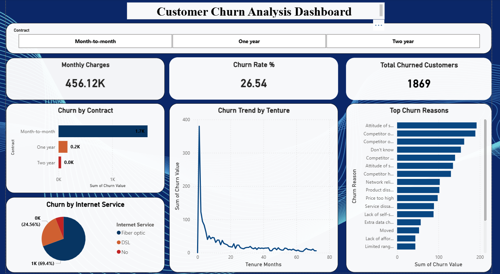
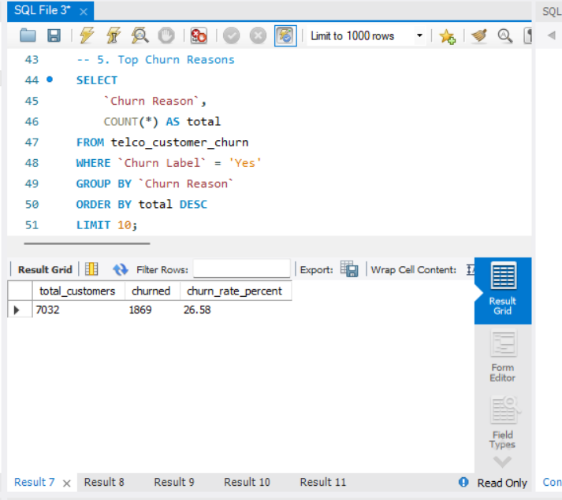
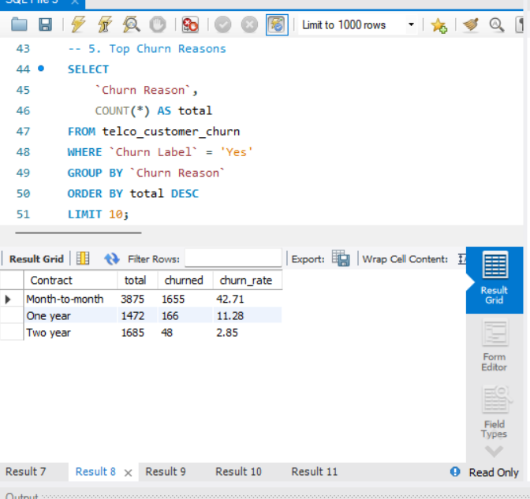
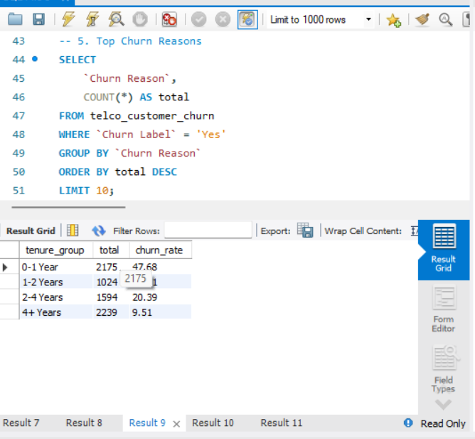
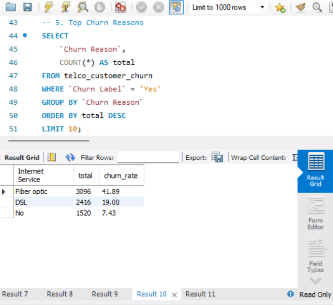
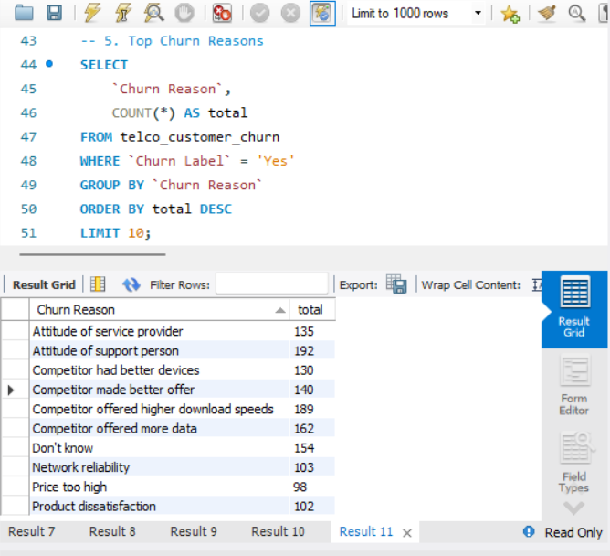

# 📊 Customer Churn Analysis | SQL & Power BI



## 📌 Project Overview
This project analyzes customer churn patterns for a California-based telecom company using **7,032 customer records** from the IBM Telco Customer Churn dataset (Kaggle). The goal is to identify high-risk customer segments and provide data-driven retention recommendations.

---

## 🛠️ Tools & Technologies
| Tool | Purpose |
|------|---------|
| MySQL | Data storage & SQL analysis |
| Power BI | Interactive dashboard |
| Excel | Raw data source |
| GitHub | Version control |

---

## 📂 Dataset
- **Source:** IBM Telco Customer Churn Dataset (Kaggle)
- **Records:** 7,032 customers
- **Columns:** 33 features
- **Location:** California, United States

---

## 🔍 Key Findings

### 📈 Overall Churn Rate
| Metric | Value |
|--------|-------|
| Total Customers | 7,032 |
| Churned Customers | 1,869 |
| **Churn Rate** | **26.54%** |

---

### 📋 Churn by Contract Type
| Contract | Total | Churned | Churn Rate |
|----------|-------|---------|------------|
| Month-to-month | 3,875 | 1,655 | **42.71%** ⚠️ |
| One year | 1,472 | 166 | 11.28% |
| Two year | 1,685 | 48 | **2.85%** ✅ |

> 💡 **Key Insight:** Month-to-month customers churn **15x more** than two-year contract customers!

---

### ⏳ Churn by Tenure Group
| Tenure | Churn Rate |
|--------|------------|
| 0-1 Year | **47.68%** ⚠️ |
| 1-2 Years | 28.71% |
| 2-4 Years | 20.39% |
| 4+ Years | **9.51%** ✅ |

> 💡 **Key Insight:** New customers in first year are highest risk at 47.68%!

---

### 🌐 Churn by Internet Service
| Service | Churn Rate |
|---------|------------|
| Fiber Optic | **41.89%** ⚠️ |
| DSL | 19.00% |
| No Internet | 7.43% ✅ |

---

### 🏆 Top Churn Reasons
1. Attitude of support person
2. Competitor offered higher download speeds
3. Competitor offered more data
4. Don't know
5. Competitor made better offer

---

## 📊 SQL Analysis

### Queries Performed:
- Overall churn rate calculation
- Churn segmentation by contract type
- Churn analysis by tenure group
- Churn by internet service type
- Top churn reasons identification

### SQL File:
📄 [churn_analysis.sql](churn_analysis.sql)

---

## 📸 Screenshots

### Overall Churn Rate


### Churn by Contract


### Churn by Tenure


### Churn by Internet Service


### Top Churn Reasons


---

## 📊 Power BI Dashboard
Interactive dashboard with:
- ✅ Churn Rate KPI Card (26.54%)
- ✅ Total Churned Customers Card (1,869)
- ✅ Monthly Charges Card (456.12K)
- ✅ Churn by Contract Bar Chart
- ✅ Churn Trend by Tenure Line Chart
- ✅ Churn by Internet Service Pie Chart
- ✅ Top Churn Reasons Bar Chart
- ✅ Contract Type Slicer (Interactive Filter)

---

## 💡 Business Recommendations
1. **Target Month-to-month customers** with loyalty discounts to convert to annual contracts
2. **Focus retention efforts on new customers** (0-1 year) with onboarding programs
3. **Investigate Fiber Optic service quality** — highest churn at 41.89%
4. **Improve customer support** — attitude of support person is #1 churn reason
5. **Compete on data & speed offers** — competitors are winning customers away

---

## 📁 Project Structure
```
customer-churn-analysis/
├── churn_analysis.sql
├── README.md
├── 01_overall_churn_rate.png.png
├── 02_churn_by_contract.png.png
├── 03_churn_by_tenure.png.png
├── 04_churn_by_internet_service.png.png
├── 05_top_churn_reasons.png.png
└── 06_powerbi_dashboard.png.png
```

---

## 👩‍💻 Author
**Devika** | Aspiring Data Analyst
- GitHub: [@Devika22-2](https://github.com/Devika22-2)

---
⭐ If you found this project helpful, please give it a star!
